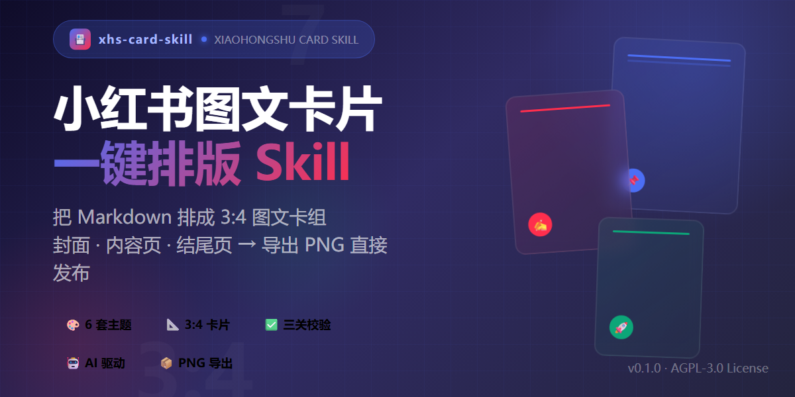

<div align="center">

# xhs-card · 小红书图文卡片排版 Skill

**把 Markdown 一键排成 3:4 小红书图文卡组（封面 + 内容页 + 结尾页），导出 PNG 直接发布。**

6 套卡片主题 + 主题生成器 · 语义切页（每卡一个记忆点） · 博主人设包 · 三关质量校验（含像素级溢出检测）

[](LICENSE)
[](https://claude.ai/code)
[](references/theme-index.md)
[](CONTRIBUTING.md)
[](#-快速开始)

> 本项目是 [gzh-design-skill](https://github.com/isjiamu/gzh-design-skill) 设计哲学的姊妹件：**长文发公众号、卡片发小红书**。

</div>

---

一个给 AI Agent（Claude Code / Codex / Cursor 等）用的小红书图文卡片排版 Skill。你写完 Markdown，它按你选的主题，生成 **3:4 比例的精美卡组 HTML**，再通过 Playwright 渲染成 PNG——自动切页、控制字数预算、落实安全区、打人设角标，并用三关校验脚本确定性兜住小红书平台的各种限制。

## ✨ 核心特性

- **6 套精选主题**：番茄手帐（默认）· 黑白报刊 · 蓝图笔记 · 便利贴拼贴 · 薄荷实验室 · 霓虹磁带 —— 每套都是自成体系的组件库（设计变量 + 封面/内容页/结尾页三段式 + 配方表）。
- **主题生成器**：不满足现成主题？用一句话描述或一张参考图，生成一套全新卡片主题并保存本地复用（见 `references/theme-generator.md`）。
- **语义切页**：按记忆点密度把长文切成 ≤7 张内容卡，每卡一个核心观点，不硬截断。
- **字数预算**：封面 ≤40 字、内容页 ≤140 字、结尾页 ≤120 字（CJK），脚本强制检查。
- **安全区保障**：四周 padding ≥ 80px，防小红书裁切；字号 ≥ 28px 保证手机可读。
- **样式全内联**：禁 `class=`、禁外部字体、禁 `position:fixed`，所有样式内联。
- **三关质量校验**：`card_lint.py`（组件库源头）+ `validate_card.py`（逐卡规则）+ `render_check.py`（像素级溢出检测），构成可复现的「改→验→修」闭环。
- **一键导出 PNG**：Playwright 无头渲染，输出逐卡 PNG 直接发布。

## 👀 效果预览

<p align="center">

</p>

## ✅ 适合 / ❌ 不适合

**✅ 适合**：干货清单 · 工具盘点 · 教程步骤拆解 · 观点认知类 · 生活经验复盘 · 测评对比数据类 · AI/科技趋势 —— 把 Markdown 长文排成 3:4 小红书图文卡组，导出 PNG 直接发布。

**❌ 不适合**：公众号长文（用 gzh-design-skill）· PPT · 普通网页 · 纯图片海报（非卡片形式）· 代写文章（本 skill 只排版、不写作——先有 Markdown 再用它）。

## 🗂 常见使用场景

| 你的内容 | 推荐怎么排 |
|---|---|
| 干货清单 / 工具盘点 | 番茄手帐；step-label + 卡片 |
| 观点 / 认知类 | 黑白报刊；大字报风 + 金句 |
| 教程 / 步骤拆解 | 蓝图笔记；数字序号 + 代码块 |
| 测评 / 对比 / 数据类 | 薄荷实验室；数据卡 + 表格 |
| 生活经验 / 碰壁复盘 | 便利贴拼贴；手帐质感 |
| AI / 科技趋势 | 霓虹磁带；酷炫渐变 |

## 🎨 6 套精选主题

覆盖绝大多数小红书题材，每套都打磨到「拿来即用」：

| 主色 | 主题 | 适用 |
|---|---|---|
| `#FF2E4D` | 番茄手帐（默认） | 干货清单、工具盘点 |
| `#1A1A1A` | 黑白报刊 | 观点、认知类（大字报风） |
| `#4C6EF5` | 蓝图笔记 | 教程、步骤拆解 |
| `#F59F00` | 便利贴拼贴 | 生活经验、碰壁复盘 |
| `#0CA678` | 薄荷实验室 | 测评、对比、数据类 |
| `#845EF7` | 霓虹磁带 | AI/科技趋势、酷炫题材 |

> 完整速查表见 [`references/theme-index.md`](references/theme-index.md)；不够用就让 AI [生成新主题](#-faq)。

## 🚀 快速开始

### 方式一：一行安装（推荐）

```bash
npx skills add https://github.com/jiangnan030-del/xhs-card-skill
```

### 方式二：让 AI 自己装

对**任意 Agent**（Claude Code / Codex / Cursor 等）说一句：

> 请帮我查找并自动安装 https://github.com/jiangnan030-del/xhs-card-skill 这个 skill

它会自行 clone 到对应的 skills 目录并接入。

### 方式三：手动 clone

```bash
git clone https://github.com/jiangnan030-del/xhs-card-skill.git ~/.claude/skills/xhs-card
```

装好后，直接对 Agent 说：

> 用番茄手帐把这篇文章排成小红书卡片：`article.md`

## 📖 使用流程

1. **选主题** — 按题材查 `references/theme-index.md` 推荐并一步确认（默认番茄手帐）；也可直接指定，或让 AI 生成新主题。
2. **读组件库** — 读所选 `references/theme-{id}.md`（变量表/组件/配方表）。
3. **语义切页** — 按 `references/pagination.md` 把正文切成 ≤7 张内容卡，每卡一个记忆点。
4. **封面装配** — 提炼大字报标题 + 副题 + ≤3 钩子点，给 3 套封面候选一步选定。
5. **内容页装配** — 按配方表拼组件：荧光标记每卡 1–2 处、数字序号、人设角标。
6. **三关校验** — 全绿才交付：
   ```bash
   python3 scripts/card_lint.py .                 # 第一关：组件库源头（须 0 ERROR）
   python3 scripts/validate_card.py out/cards.html # 第二关：逐卡规则（须 0 ERROR）
   python3 scripts/render_check.py out/cards.html  # 第三关：实渲溢出检测 + 导出 PNG
   ```
7. **输出** — `out/cards.html`（全部卡片，网格预览）+ `out/png/`（逐卡 PNG）+ 发布文案（标题 ≤20 字 + 正文 + 话题标签 3–6 个）。

## 🔁 可验证循环

改组件库或工作流后，用三关闭环防回归：

```bash
python3 scripts/card_lint.py .            # 源头关：扫组件库反模式
python3 scripts/validate_card.py out.html  # 产物关：扫逐卡合规
python3 scripts/render_check.py out.html   # 像素关：实渲溢出检测
```

- **源头关** 查组件库反模式 —— 须 0 ERROR。
- **产物关** 查字数/字号/安全区/张数/class 使用 —— 须 0 ERROR。
- **像素关** 实际渲染测溢出 + 导出 PNG。详见 `references/eval-cases.md`。

## 💡 为什么这么设计

- **约束优于自由** — 预设主题色板 + 固定组件先保住输出下限，不让模型每次现场发挥、风格飘忽。
- **字数预算硬约束** — 封面 ≤40、内容页 ≤140、结尾页 ≤120（CJK），脚本强制检查，不靠模型「自觉」。
- **质量靠脚本不靠自觉** — 三关（源头 + 产物 + 像素）确定性检查平台红线和渲染溢出，不靠模型「记得住」。
- **换模型不走样** — 排版逻辑全沉淀在组件库和校验脚本里，不依赖某家模型，Claude / GPT / Gemini / 国产模型都能跑出一致效果。
- **Agent 友好** — 输入输出全是纯文本 Markdown / HTML / PNG，任何 Agent 都能读、写、改、验，天然适配 Claude Code / Codex / Cursor。

## 📁 目录结构

```
xhs-card/
├── SKILL.md                    # 排版工作流主文档（Agent 入口）
├── references/
│   ├── theme-index.md          # 6 套主题索引（主色/适用，单一来源）
│   ├── theme-*.md              # 6 套主题组件库（theme-tomato-journal.md 等）
│   ├── theme-generator.md      # 主题生成器（按描述/参考图生成新主题）
│   ├── pagination.md           # 语义切页规则（记忆点密度/字数预算）
│   ├── persona.md              # 博主人设包（一次录入，张张复用）
│   └── eval-cases.md           # 触发用例 + 可验证循环
├── scripts/
│   ├── card_lint.py            # 组件库源头校验
│   ├── validate_card.py        # 逐卡规则校验
│   └── render_check.py         # 像素级溢出检测 + PNG 导出
├── assets/
│   ├── sample-article.md       # 演示输入
│   └── demo-cards.html         # 样例卡组预览
└── docs/gallery/               # 卡片浏览器预览
```

## ❓ FAQ

**Q：导出的 PNG 能直接发小红书吗？**
A：能。Playwright 按 1242×1660px（3:4）渲染，符合小红书图文卡规格，直接上传即可。

**Q：能自己加主题吗？**
A：两种方式。① **让 AI 生成**：说「按这个风格 / 这张图生成一套小红书卡片主题」，它会走 `references/theme-generator.md` 的流程生成组件库、登记并复用。② **手写贡献**：照 CONTRIBUTING.md 的规范，跑通可验证循环即可提 PR。

**Q：只能在 Claude Code 用吗？**
A：不限。任何能读取 Skill 目录的 Agent（Codex / Cursor 等）都能用，工作流在 `SKILL.md`。

**Q：对模型有要求吗？国产模型行不行？**
A：不挑模型，**国内外模型都能跑出一致效果**。排版逻辑全部沉淀在组件库和校验脚本里，不依赖某家模型的特殊能力。

**Q：怎么更新到最新版？**
A：重新跑 `npx skills add https://github.com/jiangnan030-del/xhs-card-skill`，或到安装目录 `git pull`。

## ⭐ Star History

如果这个项目帮到了你，点个 Star 支持一下～

<a href="https://www.star-history.com/?repos=jiangnan030-del%2Fxhs-card-skill&type=date&legend=top-left">
 <picture>
   <source media="(prefers-color-scheme: dark)" srcset="https://api.star-history.com/chart?repos=jiangnan030-del/xhs-card-skill&type=date&theme=dark&legend=top-left" />
   <source media="(prefers-color-scheme: light)" srcset="https://api.star-history.com/chart?repos=jiangnan030-del/xhs-card-skill&type=date&theme=light&legend=top-left" />
   
 </picture>
</a>

## 📄 License

**AGPL-3.0 © 2026**（与 [gzh-design-skill](https://github.com/isjiamu/gzh-design-skill) 保持一致：衍生必须开源，SaaS 部署也须开源）

完整条款见 [LICENSE](LICENSE)。

---

<div align="center">

本项目由 **[gzh-design-skill](https://github.com/isjiamu/gzh-design-skill)** 设计哲学启发 —— **长文发公众号、卡片发小红书**。

</div>
